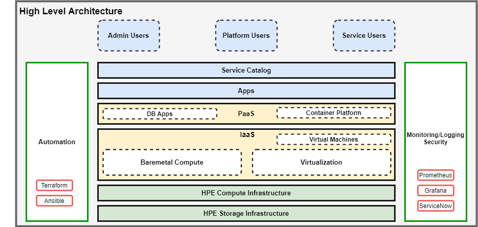
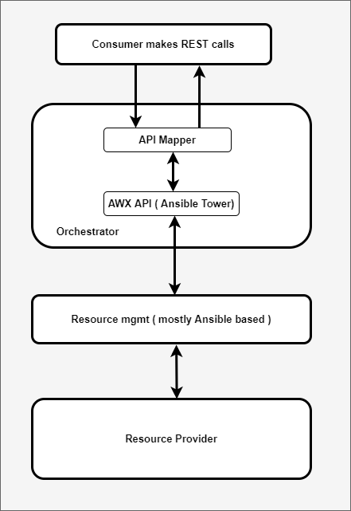
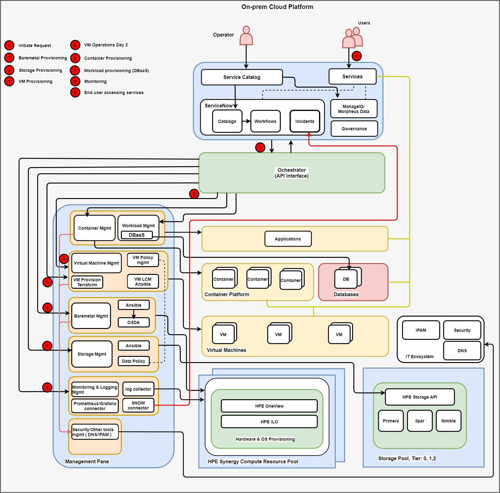

## Private cloud setup
This repo hosts the code, workflows, playbooks to setup the end-to-end fully automated private cloud on HPE infrastructure

### Overview

### Use cases
  - baremetal as a service
  - storage as a service
  - vm as a service
  - platform as a service
  - ability to monitor infrastucture
  - fully automated ( infrastructure as a code )
  - consumed as a service
  - support for day 2 options

### Solution Archicture
#### high level architecture

#### high level flow

#### Detailed architecture

### Design and Implementation

#### components
  - service catalog
  - orchestrator
  - management/controller
  - compute infrastructure
  - storage infrastructure

#### service consumption layer

#### orchestration layer

#### management/controll layer

#### infrastructure

### How to setup
  - HPE compute pool setup
  - HPE storage pool setup
  - Infra to deploy management components
     - ansible host
     - awx
     - api mapper
     - monitoring connectors

### How to test

### Trouble shooting

